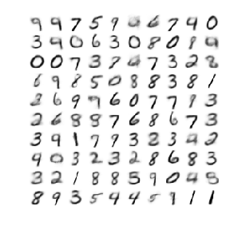
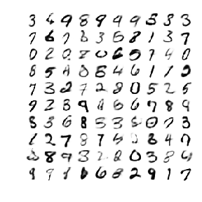
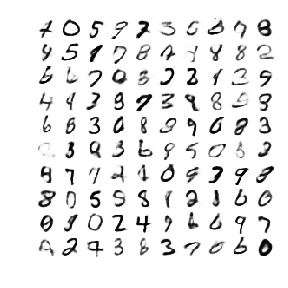
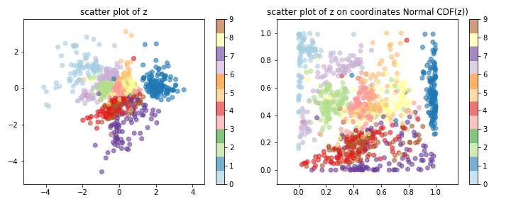
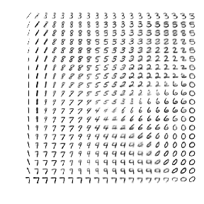

# Variational autoencoders in MXNet/Gluon

Various implementations of variational autoencoders using MXNet/Gluon.

## Basic implementation

Following original VAE papers
- Kingma, Diederik P., and Max Welling.
["Auto-encoding variational bayes."](https://arxiv.org/abs/1312.6114)
arXiv preprint arXiv:1312.6114 (2013).
- Rezende, Danilo Jimenez, Shakir Mohamed, and Daan Wierstra.
["Stochastic backpropagation and approximate inference in deep generative models."](https://arxiv.org/abs/1401.4082)
 arXiv preprint arXiv:1401.4082 (2014).

Key files:
- [vae-mxnet.ipynb](vae-mxnet.ipynb)

Results:
- Sampled generated MNIST figures with 2-D and 20-D latent space

- Learned 2-D manifold

